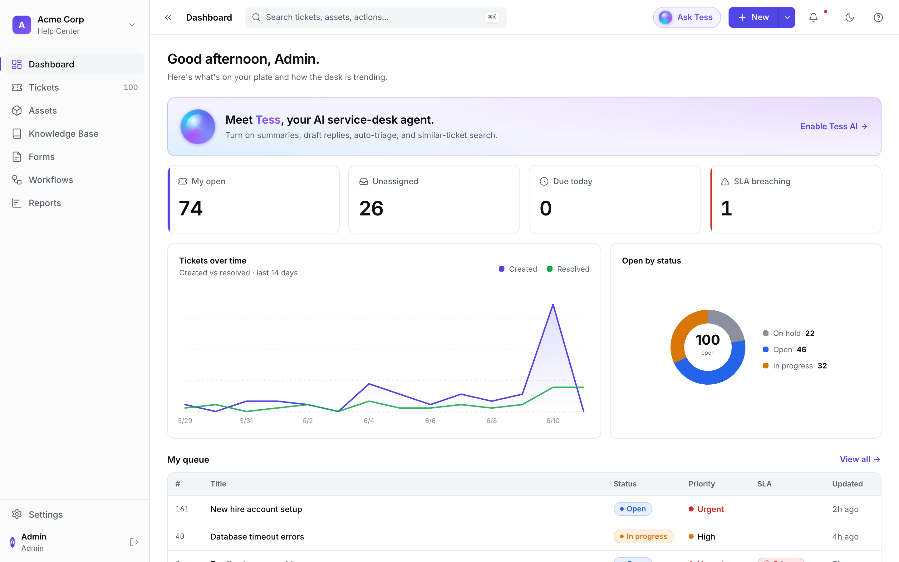
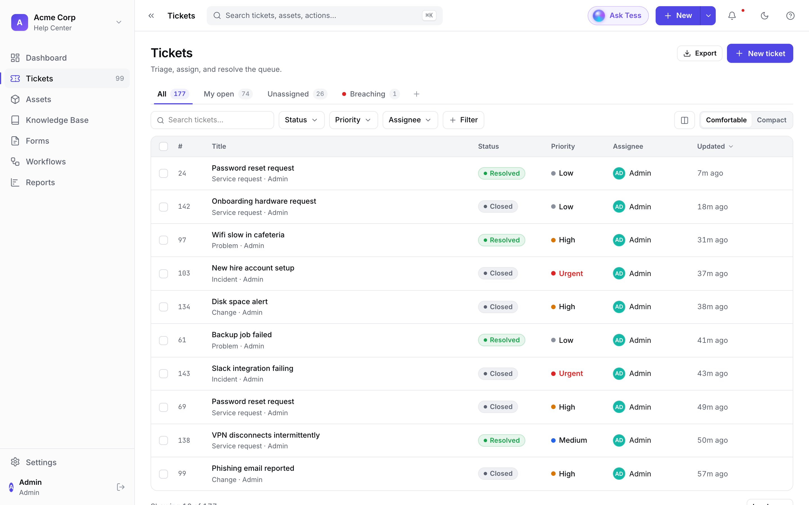
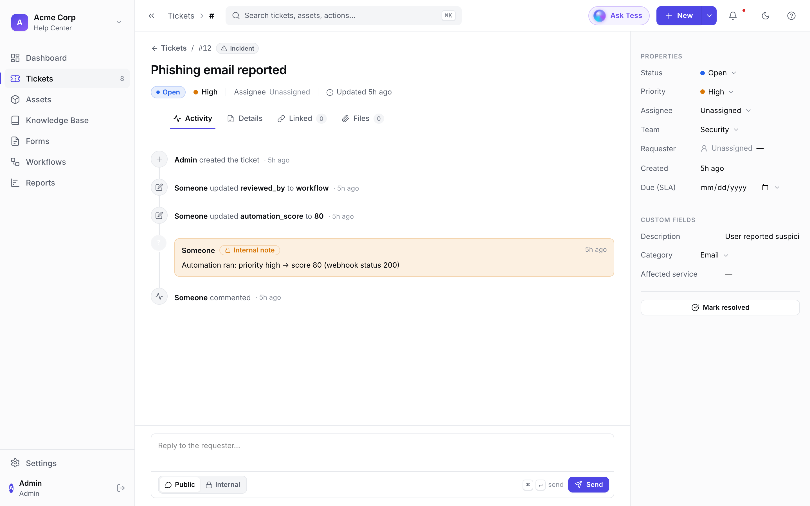
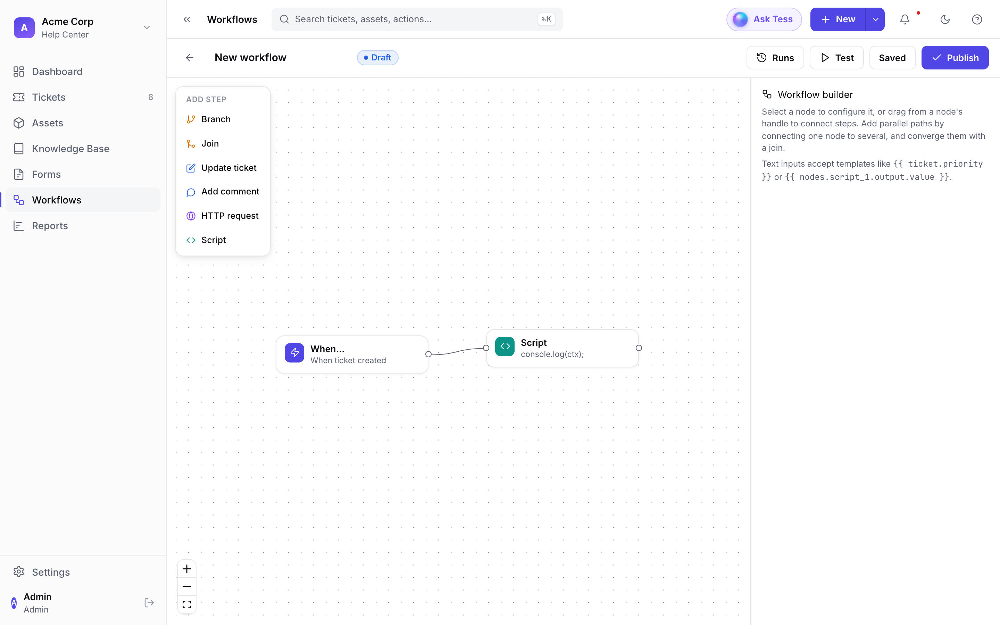
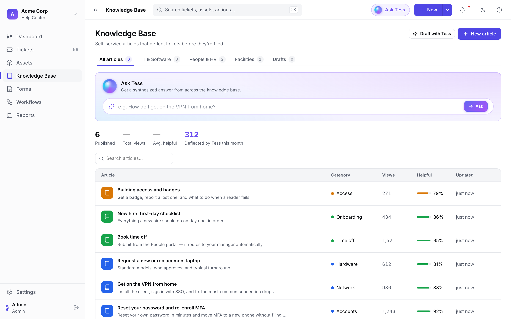
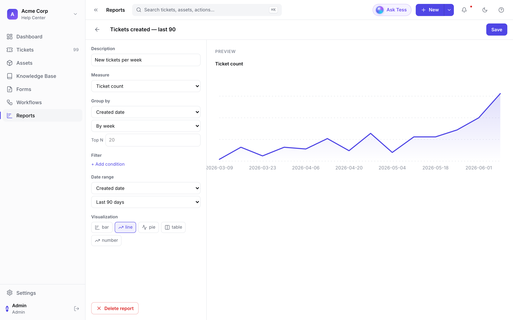
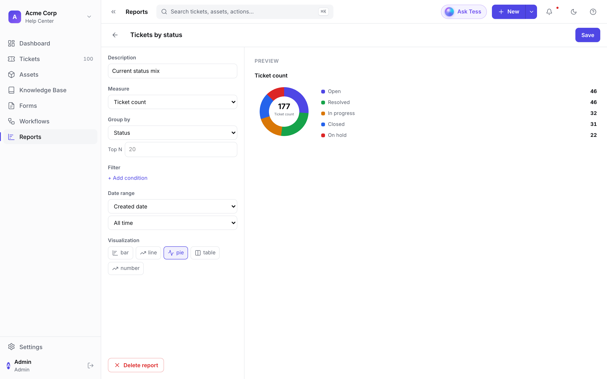
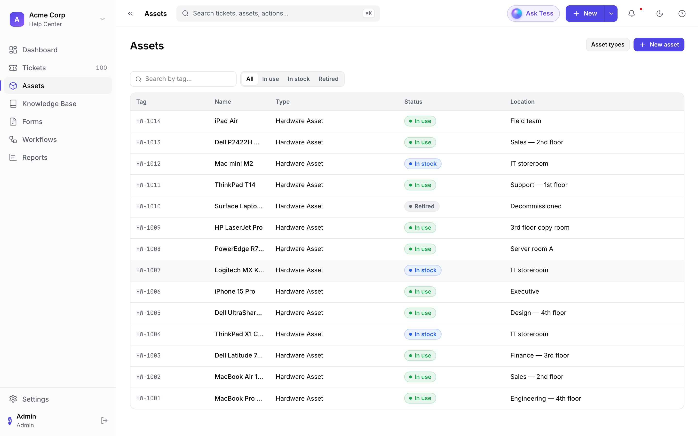
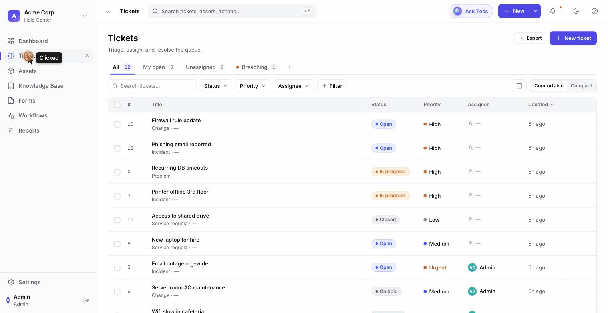
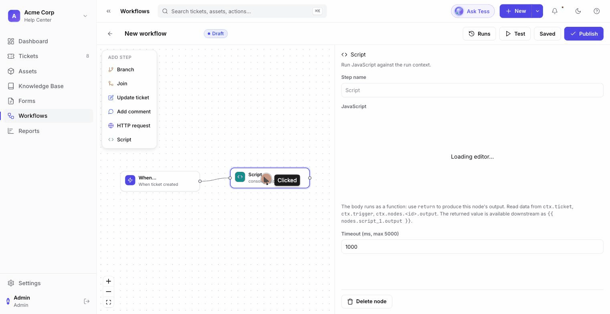

# Tessio self-hosting

Tessio is a **self-hosted ITSM platform** (proprietary; free to self-host under the [Elastic License 2.0](https://www.elastic.co/licensing/elastic-license)) — ticketing,
asset/inventory (CMDB), knowledge base, custom forms, dashboards, and workflow
automation. Every feature is free; there is no paid tier or feature gating. The project
is sustained by optional managed hosting and support.

These docs cover running and operating Tessio on your own infrastructure.

[Quickstart (5 min) →](getting-started.md){ .md-button .md-button--primary }
[Get the community edition →](https://github.com/tessio-ai/tessio){ .md-button }

## See Tessio in action

A fast, keyboard-friendly service desk you run yourself. Below are a few screens
and short clips from a running instance.

### Agent dashboard

Open/unassigned/breaching counts, a created-vs-resolved trend, and your personal
queue — the first thing an agent sees each morning.

### Ticket queue

Triage views (All / My open / Unassigned / Breaching), inline status and priority,
and filtering — built for working a real queue.

### Ticket detail

A full activity timeline (including automation notes), editable properties and SLA,
custom fields, and public/internal replies.

### Visual workflow automation

Drag-and-connect steps — branches, ticket updates, comments, HTTP calls, and
sandboxed scripts — to automate triage and routing.

### Knowledge base

Self-service articles that deflect tickets before they're filed, grouped by
category, with an "Ask Tess" answer box over your whole knowledge base.

### Custom reports

Build a report from any measure (ticket counts, resolution time, AI-triage
metrics) grouped by any dimension, and visualize it as a line, bar, pie, table,
or single number.

### Assets & inventory (CMDB)

Track hardware and inventory with tags, status, location, and warranty — filter
by lifecycle state and link assets to the tickets that affect them.

### Short clips

**Triaging a ticket** — from the dashboard into the queue and open a ticket:

**Building a workflow** — inspecting a step in the automation builder:

## Pick an install path

| Path | Best for | Containers |
| --- | --- | --- |
| [Docker Compose](install/compose.md) | A single host / VM, the recommended default | 7 (app + Postgres + Redis) |
| [Single container (all-in-one)](install/all-in-one.md) | PaaS (Fly.io, Railway), simplest footprint | 1 app container + your datastores |
| [Kubernetes (Helm)](install/kubernetes.md) | Clusters, declarative + upgrade-safe | Pods via the chart |

All paths run the same images (`ghcr.io/tessio-ai/tessio-*`) and need a
**PostgreSQL with the `pgvector` extension** plus **Redis**.

## Requirements

- **Docker** (Compose v2) for the Compose / all-in-one paths, or a **Kubernetes**
  cluster + **Helm 3** for the Helm path.
- **PostgreSQL 16** with the `vector` and `pgcrypto` extensions available (the bundled
  Postgres image `pgvector/pgvector:pg16` has them; a managed Postgres must support
  `pgvector`).
- **Redis 7** (used as the job queue).
- Two secrets you generate once: a session-signing secret and a 32-byte encryption key
  (see [Configuration](configuration.md)).

New here? Start with the [5-minute quickstart](getting-started.md).
